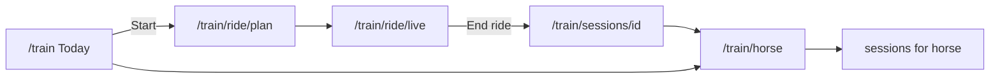

# Brief 08 — Finish Vector / The Loop (plan)

**Status:** Implemented (2026-07-19). Pressure-test assumptions applied as locked.

**Overview:** Brief 08 is partially shipped (Loop nav, Today shell, Plan/Live/Debrief routes, Train→Vector main nav). This plan finishes The Loop: rename Progress→Horse, rebuild the Horse room, gate Live sensors honestly, tighten progressive disclosure and copy, then verify — no data-model changes.

---

## Reality check (not greenfield)

| Piece | Status |
|--------|--------|
| Main/mobile nav **"Vector"** → `/train` | Done |
| Loop shell Today · Start · … | Done, but third item is **"Progress"** not **"Horse"** |
| `/train` Today layout | Mostly done; eyebrow still says **"Train"**; empty states incomplete |
| `/train/horse` | Exists but is **ProgressClient** (mock charts), not Profile·Health·Predict·History |
| Plan / Live / Debrief routes | Exist; Plan static; Live shows demo meters; Debrief half real / half prototype |
| Old tabs retired from Loop | Done (`insights` / `ai-trainer` redirect) |
| Cyan in `components/train` | Already clean; verify pages too |

**Visual targets:** `docs/vector-prototype.html` (The Loop) + `docs/vector-ux-foundation.md`. Route map: `docs/brief-08-route-map.md`.

---

## Pressure-test assumptions (locked for plan; challenge before build)

1. **Loop third tab = Horse** (brief), not Progress. Rider “progress” stays as **Today tiles** only.
2. **`/train/horse` becomes the Horse room** and replaces ProgressClient as the primary UI. Mock Progress charts are removed (not relocated as a third Loop tab).
3. **Health / Predict** show calm flags only when `sessionCount >= 3` for that horse; otherwise a short “unlocks as you ride” note — no fake clinical certainty.
4. **Live:** when `SENSORS_CONNECTED === false`, **hide** aid meters entirely (comms shell: timer + capturing + End). No animated fake meters in production UI.
5. **End ride** writes a real session tied to the **active horse** (`?horseId=` from Plan/Today, else first horse); keep canned summary/homework as MVP placeholders until a later brief.
6. **Debrief decoded moments / aid grid** only when `session_source` is `sensor` or `hybrid` **or** `SENSORS_CONNECTED`; otherwise emphasize summary + homework + training-scale (comms-only value).
7. **No schema / API changes** — reuse `api/train/*` and brief-07 session fields.

---

## STEP A — Labels (Train → Vector, kill visible “AI”)

- Grep user-facing copy under `src/app/(main)/train/**`, `src/components/train/**`, nav: replace remaining **"Train"** section labels / eyebrow / titles with **Vector**.
- Grep `"AI"`, `AI Trainer`, visible `ai-trainer` labels; keep internal filenames/routes if needed, but **no visible “AI”**. Ensure “alongside your trainer” stays on Plan.
- Keep path `/train` (no `/vector` redirect required).

Primary touch: `src/app/(main)/train/page.tsx` eyebrow; any leftover page titles.

---

## STEP B/C — Loop IA + Horse room

**Nav** — `train-layout-client.tsx`: relabel **Progress → Horse** (href stays `/train/horse`).

**Horse room** — replace `progress-client.tsx` usage in `train/horse/page.tsx` with a stacked page:

1. Horse switcher (if >1) → active horse via URL `?horseId=` (or local preference).
2. **Profile** — fields from `horse_profiles` + link Edit / Manage horses (`/train/horses`).
3. **Health** — load / recovery / symmetry as calm flags from recent sessions when unlocked; else unlock note.
4. **Predict** — readiness / “lighter week?” pattern line when unlocked; else unlock note.
5. **History** — list of this horse’s sessions → Debrief; optional “See all” → `/train/sessions?horse_id=…`.

◇ dividers / spaced-caps labels / serif headings per brand.

Keep `/train/horses/*` and `/train/sessions` as CRUD/list plumbing, not Loop tabs.

**Today** — polish `train/page.tsx`:

- Eyebrow `VECTOR`; active-horse chip + switcher; Start ride → `/train/ride/plan?horseId=…`.
- Empty states: no horse → Create horse + disabled Start; no sessions → hide Progress tiles / invite one ride.
- Prefer real streak / recent / aid % from sessions; soft prototype focus/insight copy only as fallback when empty.

---

## STEP D — Plan

- Confirm `/train/ride/plan` copy is Plan / Ask Vector only; Start ride → `/train/ride/live?horseId=…`.
- Secondary path: “Ask about a past ride” → existing video upload under `/train/ride/plan/[videoId]` — restyle labels, no “AI”.
- Keep static MVP plan conversation if still prototype; do not rebuild chat backend in this brief.

---

## STEP E — Live (honest sensors)

`ride/live/page.tsx`:

- Branch on `VECTOR_CONFIG.SENSORS_CONNECTED`.
- **Off:** status strip + timer + “Capturing this session” + optional trainer-comms indicator + End ride. No meters.
- **On:** show aid meters (placeholder until hardware).
- End ride → `POST /api/train/sessions` with `session_source: 'comms' | 'hybrid'`, real `horse_id`, then `/train/sessions/[id]`.

---

## STEP F — Debrief tighten

`sessions/[id]/page.tsx`: keep brand layout; gate prototype “decoded” / aid grid per assumption (6); always show summary/homework/training-scale when present; Share + Ask Vector already wired (brief-07).

---

## STEP G — Brand pass

- `grep -rnE "(cyan|sky|teal|blue)-[0-9]" src/app/(main)/train src/components/train` → empty.
- Same navy/gold/cream patterns; kill remaining cyan on horses/sessions list/forms if any.

---

## STEP H — Progressive disclosure

Empty states on Today + Horse room (no empty tiles/charts). One primary CTA per screen.

---

## STEP I — Verify

Brief checklist + greps (no visible AI; no cyan in train paths). List files touched.

---

## Out of scope

Real sensor streams; new progress DB tables; `/vector` redirect; brief-09 share redesign; Stripe/paywall (brief-07).

---

## Build todos (when approved)

1. Train→Vector labels; strip visible AI; Loop Progress→Horse
2. Rebuild `/train/horse` as Profile·Health·Predict·History + switcher
3. Today VECTOR eyebrow, horse chip, progressive empty states, horseId on Start
4. Plan copy/links; Live sensor gate; End ride with real horse_id + session_source
5. Debrief gate decoded UI; brand grep train pages; STEP I verify
